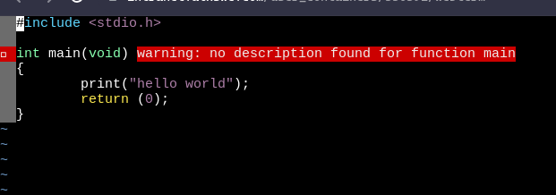
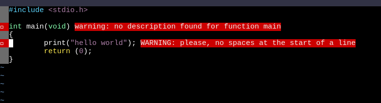
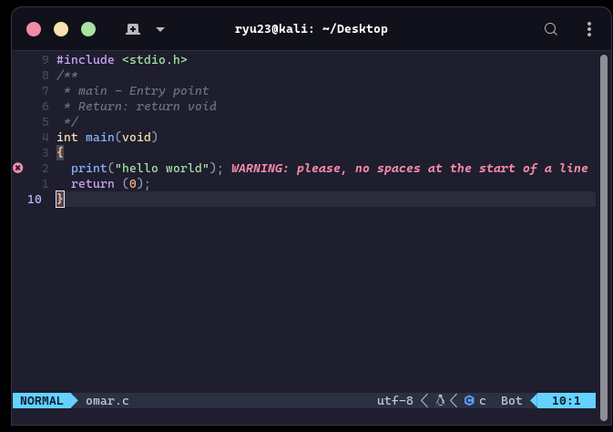

# [Betty_checker](https://github.com/RyuzakiiL23/Betty_checker/tree/main)

🐚 Betty_checker is just a simple way to check in real-time if u are respecting the Betty style and will make easy for you to detect spot the lines where u missed something. 💻

## :loudspeaker: READ TILL THE END TO NOT MISS ANYTHING :loudspeaker:

## Overview 📝

🖥️ Hello My name is Omar and Im in Cohort 13 of ALX SE programme. As many of you, I ve been strugling with the betty style when I was learning C. Spoting betty errors in a file of 10 files of 80 or even more lines is a was a hard duty to do. That's why I come back with an easy way to spot errors in your code, without going out of ur file and checking in which line the error is. And going back to ur file looking for that trailling white space that, back in time, was about to make me crazy :smile:.


## Features ✨

⚡️ Bettty_checker comes with the following features:

- It will will point the line where the betty style doesnt aquire.
- And gives you a message that explain what was the error.

## Dependencies 📦

🔧 Betty_checker has the following dependencies:

- Neovim: who is a rewrite of vim in Lua with the goal of modularizing the code to make it more maintainable and easier to contribute to.
- A lua code that will handle the errors.
- and fuse to extract some appimages.

## How it looks 📋

⚙️ Here is how your nvim in web_term will look like when it will spot an ancuracy:





⚙️ Here is how your nvim in local_term will look like when it will spot an ancuracy:



## 🚀 lETS GET STARTED 🚀

📋 To get started for web_term (for your sandbox), follow these steps:

1. Go to your sandbox, the type:
```
cd
```
Like we are sure we are on ur root directory.

2. Clone this repository and navigate to it. (you can just copy past the following lines)

```
git clone https://github.com/RyuzakiiL23/Betty_checker.git
cd Betty_checker
```

3. Will make our install.sh executable.

```
chmod u+x install.sh
```

4. Excuting install.sh to install all dedependencies.

```
./install.sh
```

4. Once it finished you can start testing by creating a C file, and instead of using vim or vi to access ur file u should use nvim  .

```
nvim example.c
```

5. Now write a code that print Hello, World! for example Then go to ur normal mode withing nvim using ur ```<esc>``` key then ```<space> <b> <e>``` to activate Betty_checker et Voila :blush:
Rememeber this is how you will always check for betty errors by using ```<esc>``` to go to normal mode then ```<space> <b> <e>```.
I'm trying to make it more easy than this, only by clicking ```<esc>``` but its a little bit laggy so I will keep working for it for sooner update.
I will add more features for the nvim setup to make it looks more colorfull and more plesant to use but this will be for a sooner update as well.
Stay tuned :pray:.

📋 To get started for local_term (for the onces who are using vim or neovim in there local machins), here is how it goes:

1st update ur machine by:

```
sudo apt update && sudo apt upgrade
```

This is only for Debian destrebution (kali Ubunto etc) for other destribution it will come later.

If you are using vim you can follow the bellow steps as for sandbox.

If you are already using neovim and u didnt install no configuration on it you can do as follow But only if u have No preconfiguration for it:

1. Go to your sandbox, the type:
```
cd
```
Like we are sure we are on ur root directory.

2. Clone this repository and navigate to it. (you can just copy past the following lines)

```
git clone https://github.com/RyuzakiiL23/Betty_checker.git
cd Betty_checker
```

3. Will make our install.sh executable.

```
chmod u+x local_install.sh
```

4. Excuting install.sh to install all dedependencies.

```
./local_install.sh
```

4. Once it finished you can start testing by creating a C file, and instead of using vim or vi to access ur file u should use nvim  .

```
nvim example.c
```

5. Now write a code that print Hello, World! for example Then go to ur normal mode withing nvim using ur ```<esc>``` key then ```<space> <b> <e>``` to activate Betty_checker et Voila :blush:
Rememeber this is how you will always check for betty errors by using ```<esc>``` to go to normal mode then ```<space> <b> <e>```.

🤝 If you have a preconfiguration for ur neovim you should be enough familiar with nvim so all what you have to do is to place the lines inside init.lua to ur init.lua and add the file lua/betty_checker.lua to ur plugins and thats it.


🎉 Thats all for now I hope this little setup well help you in your journey. I will add more features soon for colors and even some keymapping to make ur nvim looks awsome so give this repo a star to save it for latter 😊!
